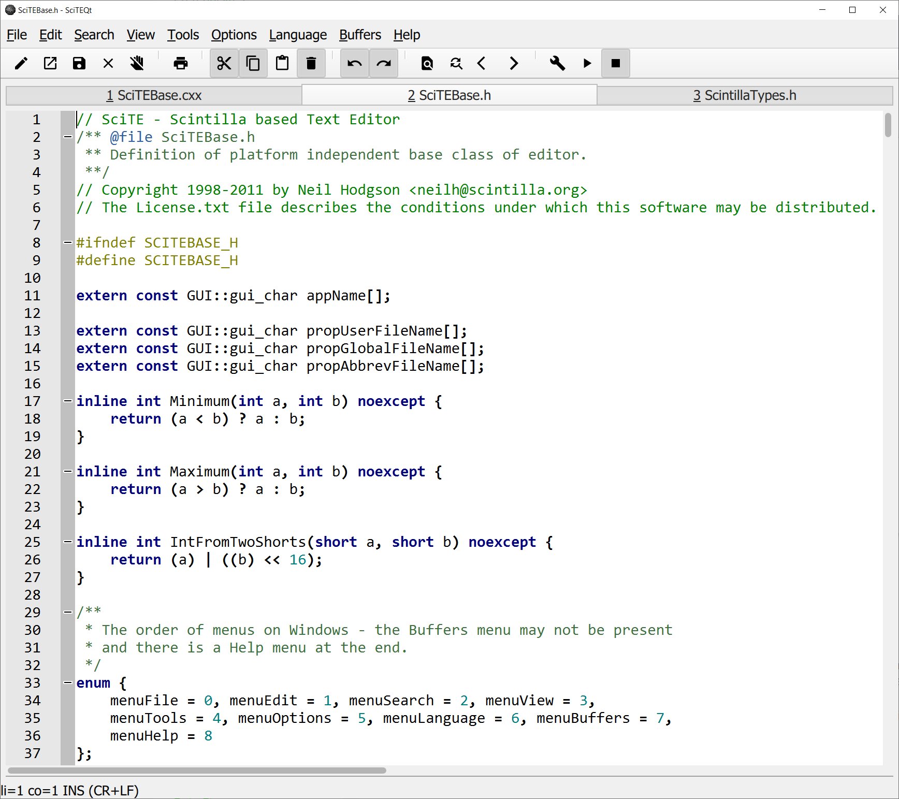

# SciteQt

A port of the [SciTE editor](https://www.scintilla.org/SciTE.html) to the Qt QML/Quick platform, which is optimized for touch devices.

All target platforms of the Qt framework are supported (Android, IOS, Webassembly, Windows, Mac and Linux). The application runs even in a [browser via Webassembly](http://mneuroth.de/sciteqt.html).
The minimum Qt version needed to compile SciteQt is Qt 5.11.3.

More screenshots for different platforms:

[Windows](scite/qt/doc/sciteqt_new_menu_win.png), [Linux](scite/qt/doc/sciteqt_ubuntu.png), [MacOS](scite/qt/doc/sciteqt_macos.png) and [Android](scite/qt/doc/sciteqt_android.png)

Build status: 

