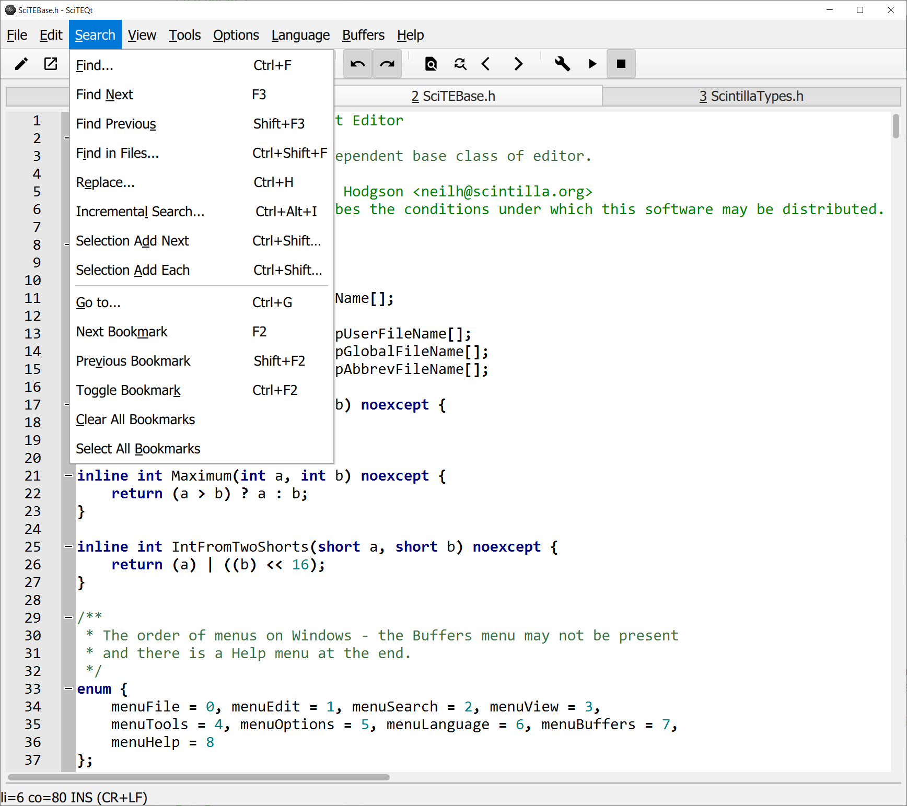
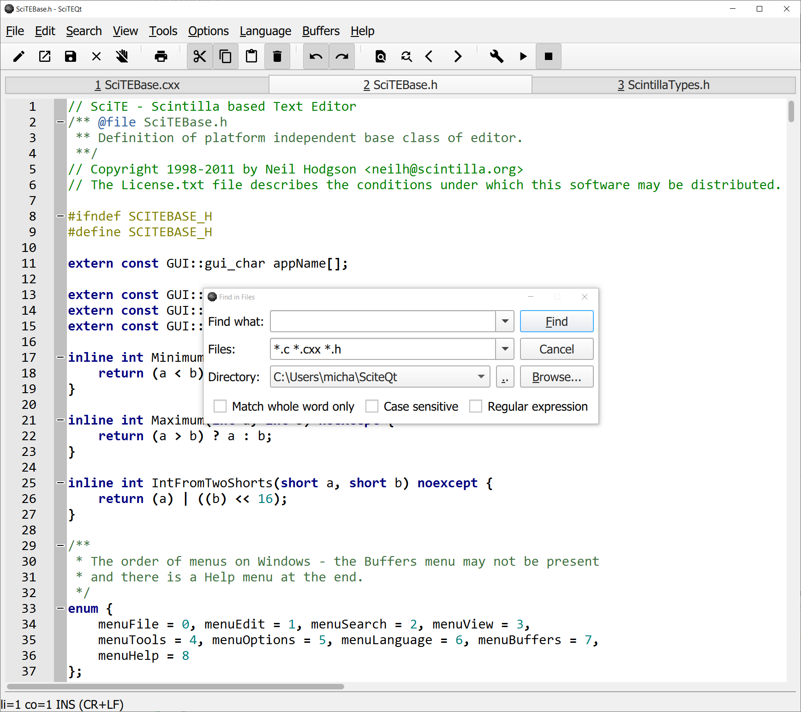
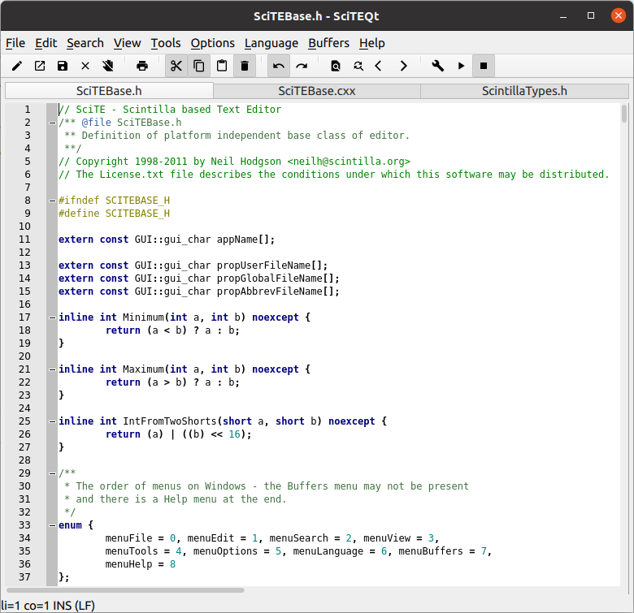
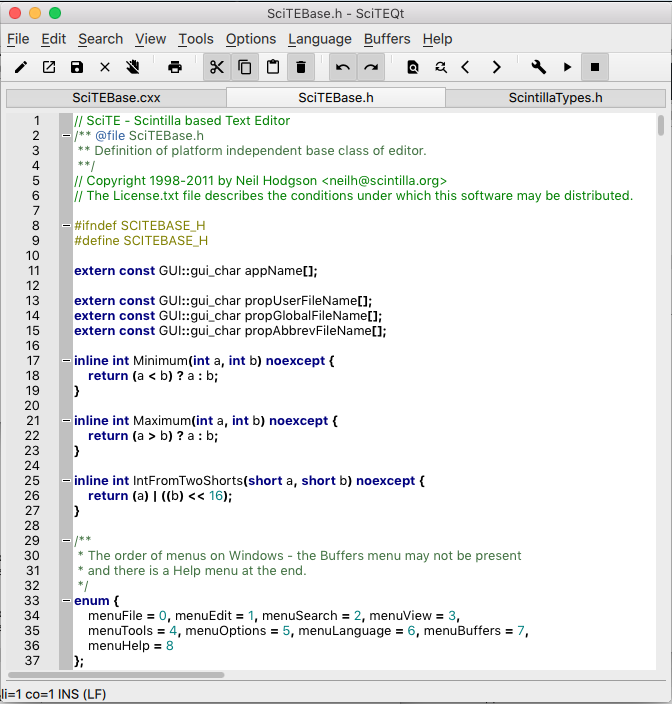
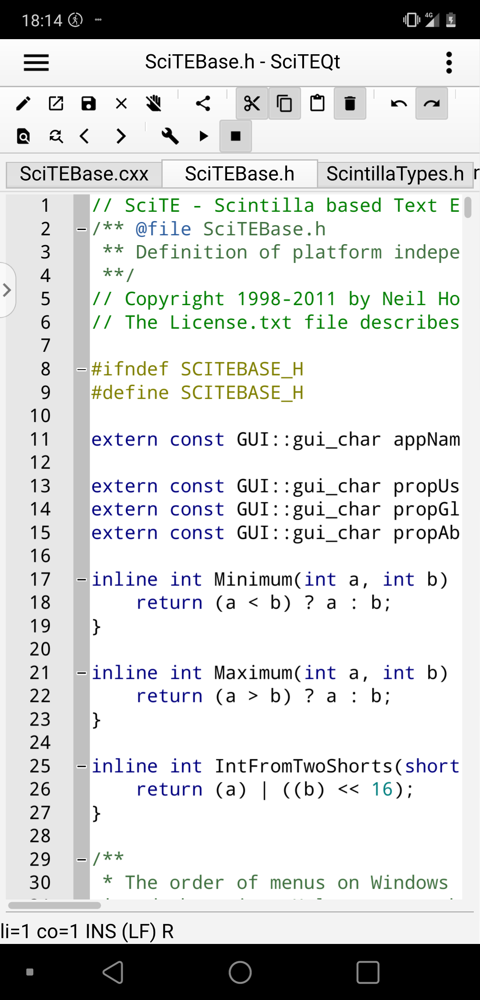

# SciteQt Screenshots

SciteQt on Windows 10

SciteQt with Menu opened on Windows 10

SciteQt with Find In Files dialog on Windows 10

SciteQt on Ubuntu Linux

SciteQt on MacOS X

SciteQt on Android
